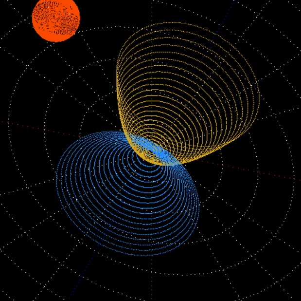

# Canvas Exploration
I loved my graphing calculator! I drew math functions, fractals, and 3D images to impress the ladies. With JavaScript, I've found that I can draw on an HTML canvas just like the good old days. It seems like good practice for getting comfortable with applying JavaScript. Here is my journey: 
- [Canvas Exploration Site](https://quackersncheese.github.io/Canvas-Exploration/)

### Sneak Peak
